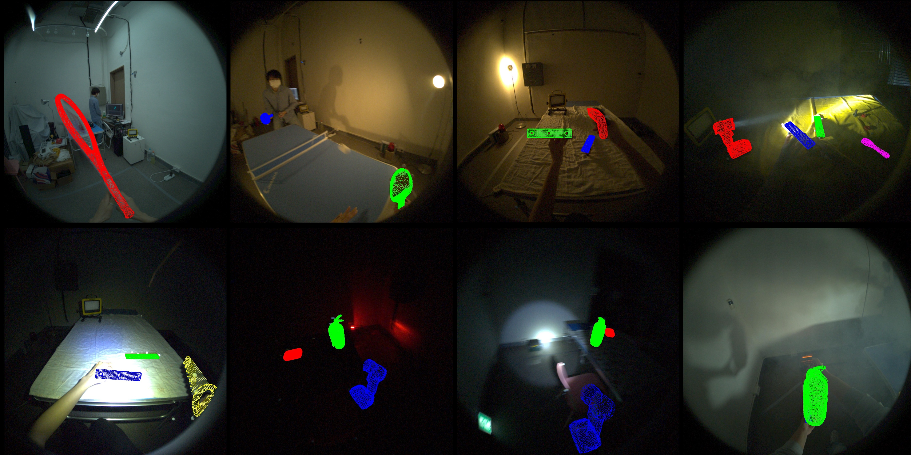

# EgoXtreme: A Dataset for Robust Object Pose Estimation in Egocentric Views under Extreme Conditions
**EgoXtreme** is a novel, large-scale dataset designed for robust egocentric 6D object pose estimation under extreme conditions.

[Project page](https://taegyoun88.github.io/EgoXtreme/) [Paper] [Dataset]



## News
(2026-02-21) Our paper has been accepted to CVPR 2026! The full version is now available on [arXiv].

## Dataset Download
Please register, sign the dataset license and download the dataset at [Dataset] (Coming Soon)

## Requirements
+ **[hand_tracking_toolkit](https://github.com/facebookresearch/hand_tracking_toolkit)**
+ **opencv-python**
+ **open3d**

## Dataset Information
EgoXtreme is a novel large-scale dataset designed for robust egocentric 6D object pose estimation under extreme environmental conditions. The dataset comprises approximately 1.3 million frames with a total duration of 775.5 minutes (~12.9 hours). It was captured at 30 fps using Aria glasses, providing high-resolution 1408 $\times$ 1408 raw fisheye RGB images along with their undistorted versions.The dataset features 15 participants performing diverse interactions with 13 different objects (including sports equipment, assembly blocks, and emergency supplies). It is divided into training (518.8 min), validation (80.7 min), and test (176 min) sets across three challenging scenarios: Industrial Maintenance, Sports, and Emergency Rescue.

## Scenario Configurations
The detailed configurations of illumination and environmental conditions for each scenario are summarized below:
| **Scenario** | **Standard**<br><sub>(normal, middle, high)</sub> | **Extreme**<br><sub>(low)</sub> | **Extreme**<br><sub>(head)</sub> | **Extreme**<br><sub>(flash)</sub> | **Extreme**<br><sub>(warning)</sub> | **Extreme**<br><sub>(green)</sub> | **Smoke** | **Object** |
| :--- | :---: | :---: | :---: | :---: | :---: | :---: | :---: | :---: |
| **Maintenance** | ✔️ | ✔️ | ✔️ | ✔️ | | | ✔️ | 5 |
| **Sports** | ✔️ | ✔️ | | | | | ✔️ | 5 |
| **Emergency** | ✔️ | ✔️ | | | ✔️ | ✔️ | ✔️ | 3 |

## Dataset Documentation
All annotation files (*.json) and model information strictly follow the BOP (Benchmark for 6D Object Pose Estimation) format. Please refer to the BOP Challenge website for detailed format specifications.

## Directory Structure
The structure of the EgoXtreme dataset is organized as follows.
Note: To reduce storage size, rgb_undist and mask_undist folders are not included in the initial download. Please refer to the Undistortion section below to generate them.

```
EgoXtreme
├── detections/                                  # Default detections (CNOS + SAM)
│   ├── cnos-sam_egoxtreme-test_sports.json
│   ├── cnos-sam_egoxtreme-test_maintenance.json
│   └── ...
├── models/
│   ├── modles_info.json
│   ├── obj_01.ply
│   ├── obj_02.ply
│   └── ...
├── data/
│   ├── train/
│   │   ├── 000000/                              # Scene ID
│   │   │   ├── rgb/                             # Raw fisheye RGB images
│   │   │   ├── mask/                            # Full object masks
│   │   │   ├── scene_camera.json
│   │   │   ├── scene_gt.json
│   │   │   ├── scene_gt_info.json
│   │   │   ├── scene_camera_undist.json
│   │   │   │
│   │   │   │   # Generated by tools/undistortion.py
│   │   │   ├── rgb_undist/ (*)                  # Undistorted RGB images
│   │   │   └── mask_undist/ (*)                 # Undistorted object masks
│   │   └── ...
│   ├── test/
│   │   ├── 000000/
│   │   └── ...
├── tools/
│   ├── undistortion.py                          # Script to generate undistorted data
│   └── visualization.py                         # Helper script to visualize 6D pose
└── camera.json
```

## Undistortion
Due to the large file size, rgb_undist and mask_undist folders are not included in the dataset. You can generate them using the provided script.

Run the following command:

```
# Process a specific scene
python tools/undistortion.py --data_dir ./data/train --scene_id 000000

# Process all scenes in train/test set
python tools/undistortion.py --data_dir ./data/train --all
```

## Visualization
To visualize the Ground Truth pose on the images.

```
# Visualize specific scene (Add --undist for undistorted images, --im_id for single frame)
python tools/visualization.py --data_dir ./data/test --scene_id 000000 --models_dir ./models [--undist] [--im_id 0]
```

## Baseline Results
We established baselines using recent state-of-the-art RGB-only zero-shot models ([FoundPose](https://github.com/facebookresearch/foundpose), [GigaPose](https://github.com/nv-nguyen/gigapose), [PicoPose](https://github.com/foollh/PicoPose)) on the three scenarios of the **EgoXtreme** dataset.
The results are evaluated using the **ADD(-S) recall** metric at **0.1d** threshold.
Full baseline results including 0.2d and 0.3d can be found in our paper.

| Scenario | Light | Smoke | FoundPose | GigaPose | PicoPose |
| :---: | :---: | :---: | :---: | :---: | :---: |
| **Sports** | Standard | | 0.53 | 4.12 | 3.13 |
| | Extreme | | 0.18 | 3.11 | 1.80 |
| **Maintenance** | Standard | | 21.02 | 33.64 | 39.27 |
| | Extreme | | 13.78 | 19.78 | 26.44 |
| | Standard | ✔️ | 14.44 | 23.01 | 26.37 |
| | Extreme | ✔️ | 11.19 | 17.56 | 20.97 |
| **Emergency** | Standard | | 6.31 | 22.03 | 22.67 |
| | Extreme | | 0.10 | 9.40 | 9.18 |
| | Standard | ✔️ | 3.52 | 16.25 | 19.66 |
| | Extreme | ✔️ | 0.11 | 7.07 | 9.45 |

## Citation

```
@inproceedings{egoxtreme2026,
  title={EgoXtreme: A Dataset for Robust Object Pose Estimation in Egocentric Views under Extreme Conditions},
  author={Yoon, Taegyoon and Han, Yegyu and Ji, Seojin and Park, Jaewoo and Kim, Sojeong and Kwon, Taein and Kim, Hyung-Sin},
  booktitle={Proceedings of the IEEE/CVF Conference on Computer Vision and Pattern Recognition (CVPR)},
  year={2026}
}
```
